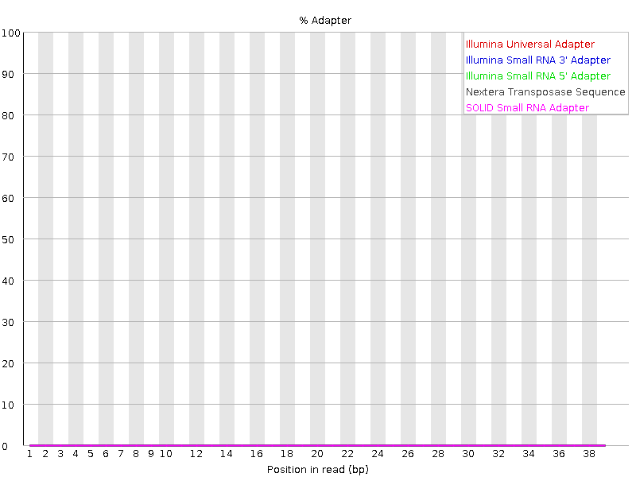

# *Graphs & results provided for sample: KO_SRR13633857*
# Step 1: FastQC Quality Control

## 📌 Purpose of FastQC
FastQC is the first step in any RNA-seq workflow. It provides a quick overview of the quality of raw sequencing reads to identify potential problems before downstream analysis.  
It checks for base quality, GC content, adapter contamination, duplication, overrepresented sequences, and other metrics.

---
## 📊 FastQC Report Modules & Interpretation

Below are the main graphs in a FastQC report, what they mean, what is expected in high-quality data, and how to interpret your results.

### 1. **Per Base Sequence Quality**

- 🔹 What is a Boxplot (in FastQC)?
  -  A boxplot summarizes the distribution of quality scores at each base position:
  -  Box (rectangle) → shows the middle 50% of values (from the 25th to 75th percentile).
  -  Horizontal line inside the box → the median (middle value).
  -  Whiskers (lines extending above/below the box) → show the overall spread of values (excluding extreme outliers).
  -  Dots → outliers (rare values much higher or lower than most data).
  
  👉 In FastQC, taller boxes or whiskers mean more variability in base quality at that position, while a flat box near the top (e.g. Q30+) means consistently high quality.
- **What it shows**: Boxplots of quality scores (Phred) for each base position across all reads.  
- **What is expected**:  
  - Scores above 30 (Q30) across most of the read = very good.  
  - Slight drop in quality at the 3′ end is normal, especially in Illumina reads.  
- **This result**: Quality scores are consistently high (>Q30) across nearly all bases, with only a minor drop at the end → acceptable.

  

---

### 2. **Per Sequence Quality Scores**
- **What it shows**: Distribution of mean quality scores per read.  
- **What is expected**: A peak toward high quality (≥30).
- **Why it matters:**
  -  Even if the per base quality looks good overall, some entire reads may be consistently low quality.
  -  Reads with very low average quality can introduce errors in alignment and quantification.
  -  This module helps detect whether a subset of your reads is problematic.
- **This result**: Peak is centered above Q30, meaning most reads are high quality.

  

---

### 3. **Per Base Sequence Content**
- **What it shows**: Proportion of each base (A, T, G, C) at each read position.  
- **What is expected**:  
  - For random libraries, lines should be roughly parallel.  
  - For RNA-seq specifically, it’s common to see bias in the first ~10–12 bases due to random hexamer priming prefer certain local motifs(desirable  physical and biochemical features) during library prep.
- **What is Random Hexamer Priming?**
  -  a molecular biology technique that uses a mixture of short, single-stranded DNA sequences (hexamers) with random nucleotide combinations to initiate DNA synthesis along a template strand.
- **Why it matters:**
  -  In an ideal random library, the four bases should be evenly represented across positions.
  -  Large deviations can suggest technical biases (e.g., priming bias, adapter sequences, contamination).
- **This result**: Some imbalance at the first ~10 bases (expected for RNA-seq), then lines stabilize → normal.

  

---

### 4. **Per Sequence GC Content**
- **What it shows**: Distribution of GC content per read.  
- **What is expected**: A bell-shaped curve close to theoretical distribution for the organism.
-  **X-axis** = the GC percentage per read (from 0% to 100%).
-  **Y-axis** = the number (or proportion) of reads that have that GC%.
-  **Why it matters:**
  -  Each organism has a characteristic overall GC content (e.g., ~40–50% for human and mouse).
  -  Deviations (e.g., shifted peaks, multiple peaks) can signal contamination, bias in library prep, or non-random subsets of reads.
- **This result**: Curve is symmetric around expected GC percentage (~40–50% for human/mouse) → good.

  

---

### 5. **Per Base N Content**
- **What it shows**: Frequency of undetermined bases (“N”) at each position.  
- **What is expected**: Almost zero across the read.
- **Why it matters:**
  -  When a sequencer cannot confidently identify a base, it records it as N.
  -  High N content means sequencing errors or problems with certain cycles (e.g., low signal, technical failure).
  -  Too many N’s reduce mapping accuracy because aligners can’t place those bases reliably.
- **This result**: N content is negligible → good.

  

---

### 6. **Sequence Length Distribution**
- **What it shows**: Distribution of read lengths.  
- **What is expected**: A sharp peak at the read length specified (e.g. 75 bp, 100 bp, 150 bp).
- **Why it matters:**
  -  Sequencing platforms are designed to produce reads of a fixed length (e.g., 75 bp, 100 bp, 150 bp).
  -  Consistent read length ensures uniform downstream processing (alignment, quantification).
  -  Unexpected variation in length can signal problems in library prep or trimming.
- **This result**: Uniform length matching sequencing design → correct.

  

---

### 7. **Sequence Duplication Levels**
- **What it shows**: Proportion of duplicate reads.  
- **What is expected**:  
  - RNA-seq naturally has higher duplication due to highly expressed genes.  
  - Moderate duplication is acceptable.
- **Why it matters:**
  -  Ideally, sequencing captures a wide variety of unique fragments.
  -  Too many duplicates can mean:
    -  Technical artifacts → over-amplification during PCR or low library complexity.
    -  Biological reasons → highly expressed transcripts (common in RNA-seq, e.g. ribosomal genes or abundant mRNAs).
  -  High duplication reduces the effective sequencing depth, since repeated reads don’t add new information.
- **This result**: Some duplication seen, likely reflecting abundant transcripts (expected in RNA-seq).

  

---

### 8. **Overrepresented Sequences**
- **What it shows**: Specific sequences that appear too often.  
- **What is expected**: Ideally none.
- **Why it matters:**
  -  Normally, in a diverse library, no single sequence should dominate.
  -  Overrepresented sequences may point to:
    -  Adapter or primer contamination → leftover technical sequences from library prep.
    -  Ribosomal RNA contamination → if rRNA depletion wasn’t complete.
    -  Highly expressed transcripts → in RNA-seq, some genuine biological sequences may dominate (e.g., actin, ribosomal proteins).
    -  Other contamination → such as reads from a different species or unexpected source.
- **This result**: No overrepresented sequences.

---

### 9. **Adapter Content**
- **What it shows**: Presence of adapter sequences across read positions.  
- **What is expected**: Minimal adapter signal in raw data; trimming may be needed.
- **Why it matters:**
  -  During library preparation, adapters are ligated to DNA/RNA fragments so the sequencer can read them.
  -  If the fragment is shorter than the sequencing length, the read can “run into” the adapter.
  -  Adapter contamination leads to:
    -  Incorrect alignments (since adapters don’t belong to the genome).
    -  Artificial increase in duplication.
    -  Biased downstream results.
- **This result**: Mild adapter contamination at the 3′ end → trimming step will fix this.

  

---

**General Summary of FastQC Results (All 6 Files)**
## ✅ Summary of This FastQC Results
- **Read quality**: High (Q30+ across most positions).  
- **Base composition**: Stable after initial bias (expected for RNA-seq).  
- **GC content**: Matches reference genome.  
- **Adapter content**: Present but modest → requires trimming.  
- **Duplication**: Within expected range for RNA-seq.  

Overall, your data passes quality control with only minor adapter contamination. The next step is **adapter trimming and filtering (Step 2: fastp)**.

---
