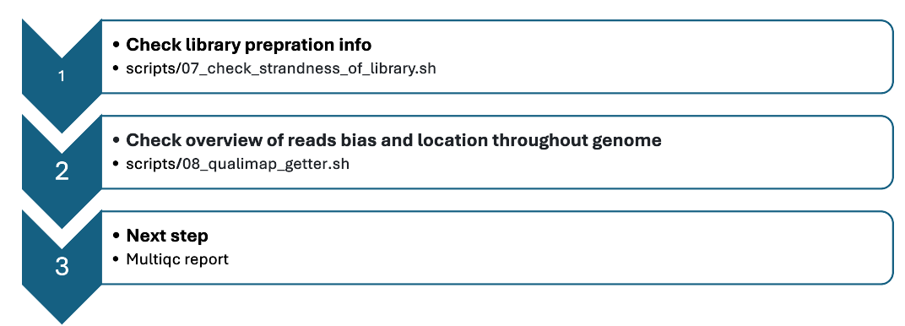

<p align="center">
  
</p>


<pre> ```mermaid flowchart TD A["1. **Check library preparation info**<br>scripts/07_check_strandness_of_library.sh"] B["2. **Check overview of reads bias and location throughout genome**<br>scripts/08_qualimap_getter.sh"] C["3. **Next step**<br>Multiqc report"] A --> B --> C ``` </pre>
